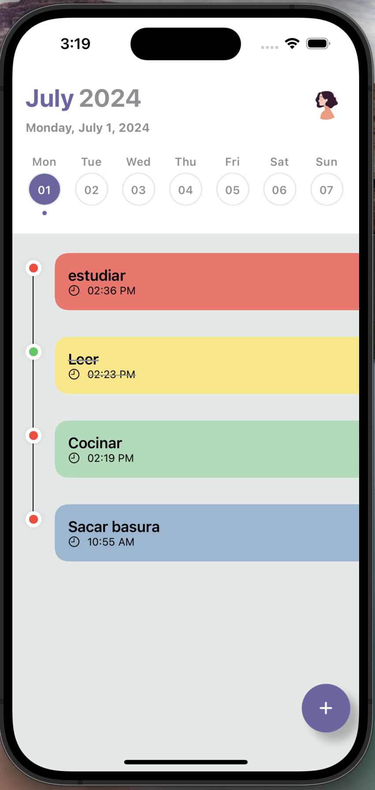

# Management App

This is a task management application designed to help users efficiently organize and manage their tasks. Built using Swift, SwiftData, and SwiftUI, the app offers a modern and intuitive user experience, making task management seamless and effective.

## Features

- Create, edit, and delete tasks
- Organize tasks by categories
- Set deadlines and priorities
- Track task completion
- User-friendly interface with SwiftUI

## Tech Stack

- Swift
- SwiftUI
- SwiftData

## Requirements
- Xcode 12.0 or later
- iOS 14.0 or later
## Usage/Examples

- Launch the app on your device or simulator.
- Create a new task by tapping the "+" button.
- Fill in the task details, set a deadline, and assign a priority level (color).
- Save the task and start managing your to-do list efficiently.

## Contributing

Contributions are always welcome!

We welcome contributions! Please fork the repository and submit pull requests.

